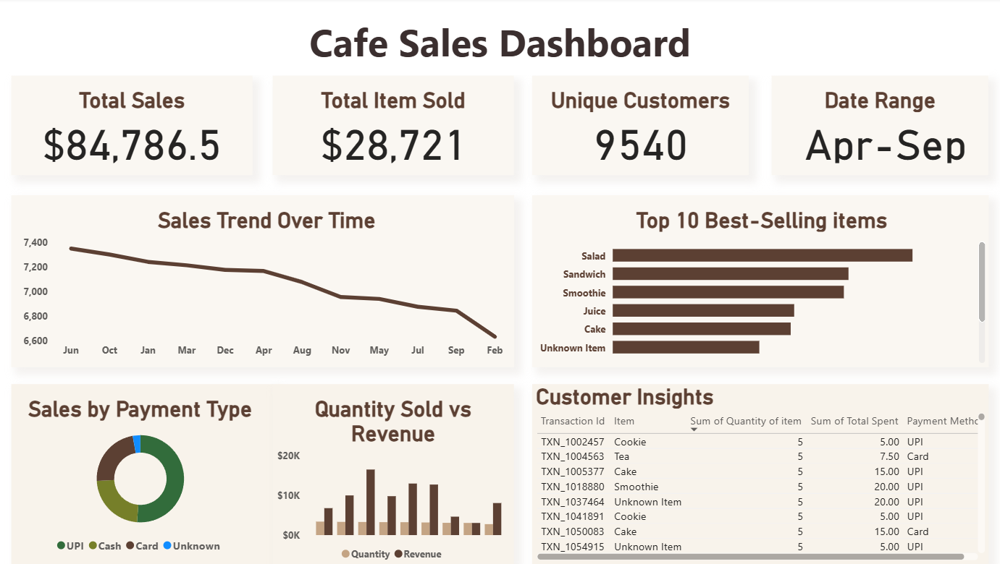

☕ Cafe Sales Dashboard (Power BI)

This is my first data analysis project — a **Cafe Sales Dashboard** built using **Power BI**.  
It helped me learn how to clean data, create visuals, and get real insights from numbers.

📊 About the Project
I used a dataset of cafe sales to explore how sales change over time, which items sell the most, and what payment methods customers prefer.

⚙️ What I did

🧹Cleaned and transformed the data using Power Query  
🧮Created DAX measures like Total Sales, Quantity, and Unique Customers  
📊Designed a dashboard with clear visuals and easy-to-read KPIs  

🧠 Key Insights
- Total Sales: $84,786.5  
- Total Items Sold: 28,721  
- Unique Customers: 9,540  
- Top Selling Items: Salad, Sandwich, Smoothie  
- Most Used Payment Type: UPI  

🧰 Tools Used
- Power BI  
- Power Query  
- DAX  
- CSV Dataset

📸 Dashboard Preview

📂 Project Files
- `Cafe_Sales_Dashboard.pbix` → Power BI dashboard file  
- `transformed_cafe_sales.csv` → Cleaned dataset  
- `preview.png` → Dashboard image  

🚀 What I Learned
This project taught me how data visualization can turn simple numbers into useful insights.  
I also learned the basics of data cleaning, DAX, and dashboard design.
